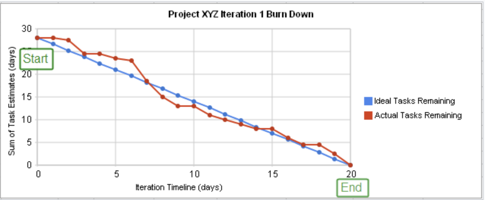

### Histórico de Revisões

| Data       | Versão | Descrição            |         Autor             |
|:----------:|:------:|:--------------------:|:-------------------------:|
| 02/10/2018 | 0.1 | Criação do Documento  | [Arthur Diniz](https://github.com/arthurbdiniz) e [Victor Moura](https://github.com/victorcmoura) |

# 1. Introdução

Este documento tem como objetivo explicitar a forma pela qual a equipe GQA utilizará o repositório, suas metodologias de gerenciamento e a localização dos artefatos produzidos.

# 2. Controle de Atividades

## 2.1 Milestones

&nbsp;&nbsp;&nbsp;O planejamento da equipe GQA será realizado, em seu nível de abstração mais alto, por  <a href="https://help.github.com/articles/about-milestones/"><i>milestones</i></a>. Uma <i>milestone</i> é um marco no ciclo de vida de um projeto. Ela indica em qual ponto no projeto haverá uma mudança de fase, uma grande entrega, ou outro evento importante.

&nbsp;&nbsp;&nbsp;&nbsp;O <b>objetivo das <i>milestones</i> neste repositório é agregar todas as atividades e artefatos que devem ser feitos até uma determinada data</b>.

&nbsp;&nbsp;&nbsp;&nbsp;As <i>milestones</i> serão definidas de acordo com o <a href="">Plano de Ensino da Disciplina de Melhoria de Processo de Software</a>. Novas <i>milestones</i> podem ser criadas de acordo com mudanças neste plano de ensino, ou de acordo com novas demandas da equipe, de maneira arbitrária.

&nbsp;&nbsp;&nbsp;&nbsp;As <i>milestones</i> definidas pela equipe GQA podem ser encontradas acessando-se a página de <a href=""><i>milestones</i></a> do projeto.

## 2.2 Kanban

&nbsp;&nbsp;&nbsp;&nbsp;&nbsp;A equipe GQA irá realizar o controle de suas atividades por meio do <i>Kanban</i>. O <i>Kanban</i> é uma metodologia criada na década de 1940 pela <i>Toyota</i> com o objetivo de otimizar a sua produção, diminuindo o desperdício e controlando o fluxo de peças produzidas. Em <i>software</i>, o <i>Kanban</i> é utilizado para visualizar e padronizar o fluxo de trabalho dentro da equipe.

&nbsp;&nbsp;&nbsp;&nbsp;O <i>Kanban</i> da equipe GQA pode ser encontrado com a utilização da ferramenta <a href="https://www.zenhub.com/"><i>Zenhub</i></a>. O <i>Zenhub</i> é um plugin para navegadores que adiciona novas funcionalidades ao <i>Github</i>, como as <i>boards</i>, que é onde o <i>Kanban</i> estará localizado.

### 2.1.1 Uso do Kanban

&nbsp;&nbsp;&nbsp;&nbsp;O quadro da equipe GQA contém quatro colunas. Cada uma delas representa um possível estado de um dos <b>itens de trabalho</b>, que serão representados pelas <a href="https://github.com/MPS-FGA/Avaleasy-GQA/issues"><i>issues</i></a> do <i>Github</i>.:

* **To-Do**: O item de trabalho não está sendo produzido.
* **Doing**: Algum membro da equipe está trabalhando neste item.
* **Review**: O item foi finalizado e está arguardando revisão por algum outro membro da equipe.
* **Done**: O item foi finalizado e aprovado.

&nbsp;&nbsp;&nbsp;&nbsp;Os itens de trabalho podem ser a <b>atividade de produção de um artefato, ou atividades genéricas</b> a serem feitas, como análises de uma auditoria ou decisões a serem tomadas. No caso de discussões ou decisões, <b>a própria <i>issue</i> deve ser utilizada como ferramenta de registrar a comunicação entre a equipe</b>.

&nbsp;&nbsp;&nbsp;&nbsp;Quando um item de trabalho começa a ser produzido, ele deve ser movido da coluna <i><b>To-Do</i></b> para a coluna <i><b>Doing</i></b>. Ao ser finalizado, ele deve ser movido para a coluna <i><b>Review</i></b>, onde outro membro deve revisá-lo (no caso de um artefato). Um <b>artefato é considerado finalizado</b> quando está estável, o que significa que o objetivo da existência deste (descrever um processo, relatar um planejamento de uma auditoria, entre outros) foi alcançado. Após essa revisão, o item deve ser movido para a coluna <i><b>Done</i></b> e a <i>issue</i> que o representa deve ser fechada.

&nbsp;&nbsp;&nbsp;&nbsp;A produção de artefatos deve ser realizada <b>diretamente no <i>github</b></i>, na <i>wiki</i> do repositório. A página do artefato deve conter um <b><i>link</i></b> em seu cabeçalho apontando para a <b><i>issue</i></b> correspondente a produção deste. De maneira análoga, a <b><i>issue</i></b> deve conter um <b><i>link</i></b> para a página do artefato.

# 3. Labels

&nbsp;&nbsp;&nbsp;&nbsp;Para possibilitar a navegação fácil do repositório e identificar qual o tipo de atividade que está sendo realizada no momento, as <i>issues</i> da equipe GQA serão etiquetadas com a ferramenta de <a href="https://help.github.com/articles/about-labels/"><i>labels</i></a> do <i>Github</i>. <i>Labels</i> são etiquetas que indicam a natureza de uma atividade, seja ela a criação de um documento de gerenciamento, a realização de uma auditoria, entre outros. A definição das <i>labels</i> se dá por maneira arbitrária. Toda <i><b>label</i></b> criada deve ter uma descrição, que indica o que ela significa.

As <i>labels</i> utilizadas pela equipe no período presente podem ser encontradas na página de <a href="https://github.com/MPS-FGA/Avaleasy-GQA/labels"><i>labels</i> do repositório</a>.

## 4. Burn Down

&nbsp;&nbsp;&nbsp;&nbsp;Um gráfico de quebras é uma representação gráfica do trabalho a ser feito versus tempo. O excelente trabalho (ou backlog) é muitas vezes no eixo vertical, com o tempo ao longo da horizontal. Isto é, é um gráfico de execução de trabalho excepcional. É útil para prever quando todo o trabalho será concluído. É frequentemente usado em metodologias ágeis de desenvolvimento de software , como o Scrum . No entanto, os gráficos burn down podem ser aplicados a qualquer projeto que contenha progresso mensurável ao longo do tempo.

# 5. Referências
  Kanban - A brief introduction. Disponível em: https://www.atlassian.com/agile/kanban.
